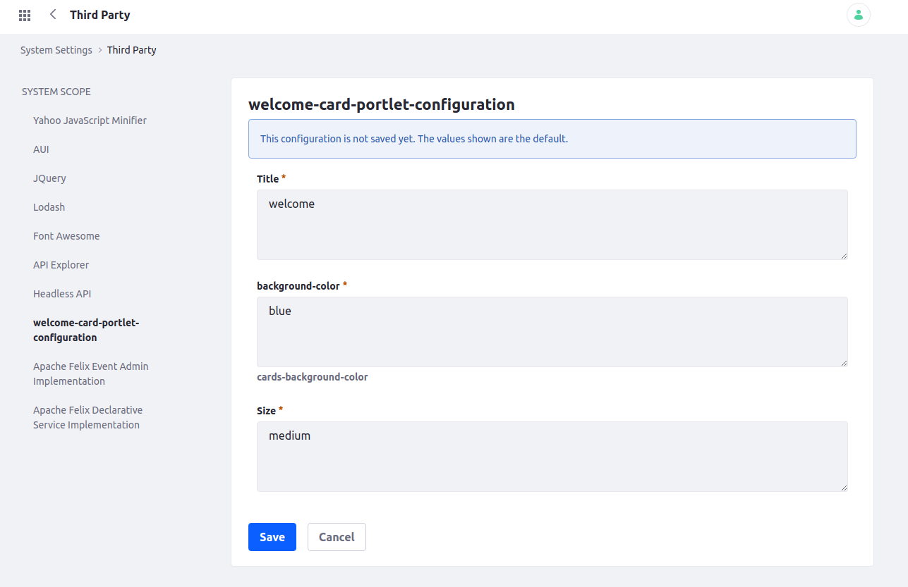

- [Configuration API Sample](#configuration-api-sample)
  - [Configuration API](#configuration-api)
  - [The project](#the-project)
  - [How to create a configuration](#how-to-create-a-configuration)
    - [The annotations](#the-annotations)
  - [Calling the configuration on the portlet](#calling-the-configuration-on-the-portlet)
  - [Creating portlet configuration](#creating-portlet-configuration)
    - [Configuration Action](#configuration-action)
    - [Portlet Configuration JSP](#portlet-configuration-jsp)
    - [Using Portlet Configuration on the portlet](#using-portlet-configuration-on-the-portlet)
    - [Using system settings Configuration as default values](#using-system-settings-configuration-as-default-values)

# Configuration API Sample

Sample project showing an application of Liferay Configuration API.

## Configuration API

If you are a back-end developer, you will probably make a lot of components, like portlets or gogo commands. Sometimes you'll want some characteristics of a component to be configurable by a portal user, in a way he doesn't have to go into Java code to configure it. That's when Configuration API comes into play. With it, you can create a set of configurable values to be used in any component you want. You can also scope it by system (throughout the system), virtual instance (company), site (group), or portlet instance (if your component is a portlet). [talk more about scopes (?)]

## The project

In this project, we will create a module with a portlet as an example. It will be a welcome card with a configurable title, background color, and size. This configurations values will have the scope of system and portlet instance.
[show two different photos of the portlet]

In practice, the configuration values scoped by system will serve only as default values for the portlet, as you can change them by setting portlet instance configurations per each instance.

## How to create a configuration

The first step is to create an interface that specifies all the configuration variables, their respective types and their scope. The default scope is system.

This interface can be created anywhere in the module, but we've followed Liferay's pattern and put it on a folder called *configuration* with the name *[portlet name]Configuration*, in this case, it is *WelcomeCardPortletConfiguration*.
[talk about categorization (?)]. You must use annotations from *Meta* class to indicate OSGI this interface is a specifying a configuration. To use this class, insert this line on your module's *build.gradle*

    compile group: "biz.aQute.bnd", name: "biz.aQute.bndlib"
    compileOnly group: "com.liferay", name: "com.liferay.portal.configuration.metatype.api"


You also need to add this line to *bnd.bnd* so bnd knows your module is using configurations.

    -metatype: *

### The annotations

**Meta.OCD**:

```java
@Meta.OCD(
    id = "com.liferay.simplify.configuration.api.sample.configuration.WelcomeCardPortletConfiguration",
    name = "welcome-card-portlet-configuration"
)
public interface WelcomeCardPortletConfiguration {
```

Where you set some properties of your configuration in general. The most important one is **id**. It is used by OSGI to identify your configuration. You should always use the interface's *package* plus its *name* preceded by a dot as your **id**.

**Meta.AD**:

```java
@Meta.AD(
    deflt = "blue",
    required = false
)
public String backgroundColor();
```

Specifies the properties of a configuration field. The interface method specifies the field itself, being its type the same as the return type of the method. In our case, we have the configuration fields of *String* type. *deflt* specifies the default value.
This annotation has various properties and you can see what each annotation attribute means by inspecting the `aQute.bnd.annotation.metatype.Meta` interface.

Now that you've created your interface, Liferay will automatically generate an UI where you can set these configuration variables, you only need to deploy this module. After deploying it, go to **Control Panel > System Settings > Third Party > welcome-card-portlet-configuration**. [talk about language.properties (?)].



Here you can configure variables to be used throughout the system. But as we need portlet scoped variables, these system values will be used only as default values for newly created portlets.

## Calling the configuration on the portlet

Using the configuration inside the portlet is very easy. You just need to indicate OSGI which configuration your component is using, by adding `configurationPid = "<configuration id>",` to the *@Component* annotation, like this

```java
@Component(
    configurationPid = "com.liferay.simplify.configuration.api.sample.configuration.WelcomeCardPortletConfiguration",
    ...
}
```

then you need to create a configuration instance when the component is activating. Add this method and field to the class

```java
@Activate
@Modified
protected void activate(Map<Object, Object> properties) {
    _welcomeCardPortletConfiguration = ConfigurableUtil.createConfigurable(
                WelcomeCardPortletConfiguration.class, properties);
}

private volatile WelcomeCardPortletConfiguration _welcomeCardPortletConfiguration;
```

The `@Activate` annotation indicates this method will run when the component is starting. The `@Modified` makes this method be called each time any configuration value changes, so your component will always be up to date. `_welcomeCardPortletConfiguration` must be *volatile* to avoid some multithreading related problems.

**Notice that these steps can be applied to any class with a *component* annotation (an OSGI component), not just a portlet.**

To test if we can use our configuration values inside the portlet, paste this method inside it

```java
@Override
public void render(RenderRequest renderRequest, RenderResponse renderResponse)
        throws IOException, PortletException {
    
    System.out.println(_welcomeCardPortletConfiguration.backgroundColor());
    System.out.println(_welcomeCardPortletConfiguration.size());
    System.out.println(_welcomeCardPortletConfiguration.title());
    
    super.render(renderRequest, renderResponse);
}
```

and see if it logs our default configuration values

```
blue
medium
welcome
```

Our configuration values are ready to be passed to the portlet's view.jsp. Explaining how the *welcome card* view.jsp works is outside the scope of this project.

## Creating portlet configuration

### Configuration Action

Now we will create a configuration UI that is accessible by any portlet instance. For that we need to create a component class that extends `DefaultConfigurationAction` and reference our portlet. We reference the portlet on the component annotation with the property `javax.portlet.name`, like this

```java
@Component(
    immediate = true,
    property = {
        "javax.portlet.name=" + WelcomeCardPortletKeys.WELCOMECARD
    },
    service = ConfigurationAction.class
)
public class WelcomeCardConfigurationAction extends DefaultConfigurationAction {
```

This class is responsible for making the connection between the portlet and the configuration, creating the configuration UI and handling its form submission. There are two main methods that you may want to override. The first one is `include`

```java
public void include(PortletConfig portletConfig, HttpServletRequest httpServletRequest,
        HttpServletResponse httpServletResponse) throws Exception {
```

It is used to include some values to the configuration JSP before rendering it. For now, we will leave that empty.
The other method is `processAction`. This one is used to handle the configuration form submission. Our configuration values scoped by portlet instance will be saved on each portlet instance's *preference* (a place where you can store values for each portlet instance). Saving values on the portlet preference is very straightforward

```java
@Override
public void processAction(
        PortletConfig portletConfig, ActionRequest actionRequest,
        ActionResponse actionResponse)
    throws Exception {

    // first you get the values from the request
    String title = ParamUtil.getString(actionRequest, "title");
    String backgroundColor = ParamUtil.getString(actionRequest, "backgroundColor");
    String size = ParamUtil.getString(actionRequest, "size");
    
    // then you save them
    setPreference(actionRequest, "title", title);
    setPreference(actionRequest, "backgroundColor", backgroundColor);
    setPreference(actionRequest, "size", size);
    
    super.processAction(portletConfig, actionRequest, actionResponse);
}
```

The connection between the configuration action and the portlet is ready. If you go into portlet `options > Configuration` you will see the error `ERROR [http-nio-8080-exec-3][PortletConfigurationPortlet:688] /configuration.jsp`. That is because Liferay is trying to render your configuration UI looking for a JSP in the default path, which is `resources/META-INF/resources/configuration.jsp`.


### Portlet Configuration JSP

Now we only need to create this file with our configuration form. It is basically a form that receives our configurations values from the user and submits them to our configuration action. At the start of the JSP, we retrieve the current configuration values from the portlet preferences, in case the user had already submitted this form. This JSP is the minimum you need to make our portlet instance configuration works

```jsp
<%@ include file="./init.jsp" %>
<%@page import="com.liferay.portal.kernel.util.Constants"%>

<%
// getting current preference values or defaults
String defaultTitle = "welcome";
String title = portletPreferences.getValue("title", defaultTitle);

String defaultBackgroundColor = "blue";
String backgroundColor = portletPreferences.getValue("backgroundColor", defaultBackgroundColor);

String defaultSize = "medium";
String size = portletPreferences.getValue("size", defaultSize);
%>

<!-- Our configuration action URL -->
<liferay-portlet:actionURL portletConfiguration="<%= true %>" var="configurationActionURL" />

<!-- URL to redirect to after the form is submitted -->
<liferay-portlet:renderURL portletConfiguration="<%= true %>" var="configurationRenderURL" />

<aui:form 
    action="<%= configurationActionURL %>"
    method="post"
    name="fm"
>
    <!-- 
        Configuration values inputs
        Notice that the input names must be the same as those
        used to retrieve its values on the configuration action 
    -->
    <aui:input name="title" value="<%= title %>" />
    <aui:select label="background-color" name="backgroundColor">
        <aui:option label="select-a-background-color" selected="true" value="" />
        <aui:option label="white" selected="<%= "white".equals(backgroundColor) %>" value="white" />
        <aui:option label="blue" selected="<%= "blue".equals(backgroundColor) %>" value="blue" />
        <aui:option label="red" selected="<%= "red".equals(backgroundColor) %>" value="red" />
    </aui:select>
    <aui:select label="size" name="size">
        <aui:option label="select-a-size" selected="true" value="" />
        <aui:option label="small" selected="<%= "small".equals(size) %>" value="small" />
        <aui:option label="medium" selected="<%= "medium".equals(size) %>" value="medium" />
        <aui:option label="large" selected="<%= "large".equals(size) %>" value="large" />
    </aui:select>

    <!-- Hidden inputs used internally by Liferay -->
    <aui:input name="<%= Constants.CMD %>" type="hidden" value="<%= Constants.UPDATE %>"/>
    <aui:input name="redirect" type="hidden" value="<%= configurationRenderURL %>" />

    <aui:button type="submit">Submit</aui:button>
</aui:form>
```

To make the form a bit more user friendly, add `<%@ taglib uri="http://liferay.com/tld/frontend" prefix="liferay-frontend" %>` line to `init.jsp` and change the configuration.jsp to this

```jsp
<%@ include file="./init.jsp" %>
<%@page import="com.liferay.portal.kernel.util.Constants"%>

<%
// getting current preference values or defaults
String defaultTitle = "welcome";
String title = portletPreferences.getValue("title", defaultTitle);

String defaultBackgroundColor = "blue";
String backgroundColor = portletPreferences.getValue("backgroundColor", defaultBackgroundColor);

String defaultSize = "medium";
String size = portletPreferences.getValue("size", defaultSize);
%>

<!-- Our configuration action URL -->
<liferay-portlet:actionURL portletConfiguration="<%= true %>" var="configurationActionURL" />

<!-- URL to redirect to after the form is submitted -->
<liferay-portlet:renderURL portletConfiguration="<%= true %>" var="configurationRenderURL" />

<liferay-frontend:edit-form 
    action="<%= configurationActionURL %>"
    method="post"
    name="fm"
>
    <liferay-frontend:edit-form-body>
        <liferay-frontend:fieldset-group markupView="lexicon">
            <!-- 
                Configuration values inputs
                Notice that the input names must be the same as those
                used to retrieve its values on the configuration action 
            -->
            <aui:input name="title" value="<%= title %>" />
            <aui:select label="background-color" name="backgroundColor">
                <aui:option label="select-a-background-color" selected="true" value="" />
                <aui:option label="white" selected="<%= "white".equals(backgroundColor) %>" value="white" />
                <aui:option label="blue" selected="<%= "blue".equals(backgroundColor) %>" value="blue" />
                <aui:option label="red" selected="<%= "red".equals(backgroundColor) %>" value="red" />
            </aui:select>
            <aui:select label="size" name="size">
                <aui:option label="select-a-size" selected="true" value="" />
                <aui:option label="small" selected="<%= "small".equals(size) %>" value="small" />
                <aui:option label="medium" selected="<%= "medium".equals(size) %>" value="medium" />
                <aui:option label="large" selected="<%= "large".equals(size) %>" value="large" />
            </aui:select>

            <!-- Hidden inputs used internally by Liferay -->
            <aui:input name="<%= Constants.CMD %>" type="hidden" value="<%= Constants.UPDATE %>"/>
            <aui:input name="redirect" type="hidden" value="<%= configurationRenderURL %>" />

        </liferay-frontend:fieldset-group>
    </liferay-frontend:edit-form-body>

    <liferay-frontend:edit-form-footer>
        <aui:button type="submit" />
        <aui:button type="cancel" />
    </liferay-frontend:edit-form-footer>
</liferay-frontend:edit-form>
```

### Using Portlet Configuration on the portlet

### Using system settings Configuration as default values